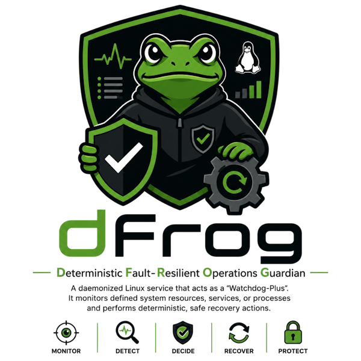

<p align="center">
  
</p>

<h1 align="center">dfrog</h1>

<p align="center"><em>Deterministic Fault-Resilient Operations Guardian</em></p>

<p align="center">
  <a href="https://github.com/yoyold/dfrog/actions/workflows/ci.yml"></a>
  <a href="LICENSE"></a>
  <a href="https://en.cppreference.com/w/cpp/20"></a>
  <a href="https://cmake.org/"></a>
  <a href="#"></a>
  <a href="https://github.com/GoogleContainerTools/distroless"></a>
  <a href=".clang-format"></a>
  <a href="https://github.com/microsoft/vcpkg"></a>
  <a href="#"></a>
</p>

---

A daemonized Linux service that watches system resources and services, and
performs **deterministic, sandboxed recovery actions** when things go wrong.
Think "watchdog plus", with a safety-first design.

> **Status:** pre-alpha. Scaffolding only — no functionality yet.

## Quickstart

```bash
# Configure & build (Debug + sanitizers)
cmake --preset dev
cmake --build --preset dev

# Run smoke tests
ctest --preset dev

# Container image
docker build -t dfrog:dev .
docker run --rm dfrog:dev --version
```

## Repository layout

```
.
├── src/         # Daemon sources
├── include/     # Public headers (plugin ABI lives here)
├── tests/       # GoogleTest unit + integration tests
├── plugins/     # Example out-of-tree plugin builds
├── cmake/       # Reusable CMake helpers (Warnings, Sanitizers)
├── deploy/      # Dockerfile target manifests, compose, k8s
└── docs/        # Architecture & user docs
```

## License

Apache-2.0 — see [LICENSE](LICENSE).
